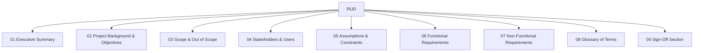

# Hospital-Patient-Portal-RUD
# Requirements Understanding Document (RUD)

```mermaid
flowchart TD
    A[RUD]

    A --> B[01 Executive Summary]
    A --> C[02 Project Background & Objectives]
    A --> D[03 Scope & Out of Scope]
    A --> E[04 Stakeholders & Users]
    A --> F[05 Assumptions & Constraints]
    A --> G[06 Functional Requirements]
    A --> H[07 Non-Functional Requirements]
    A --> I[08 Glossary of Terms]
    A --> J[09 Sign-Off Section]
```
